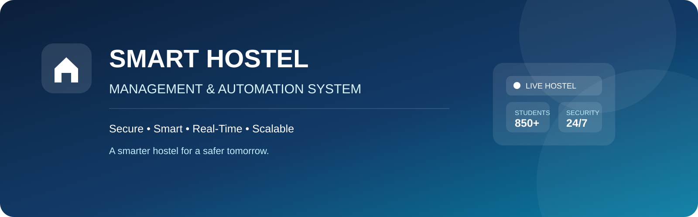
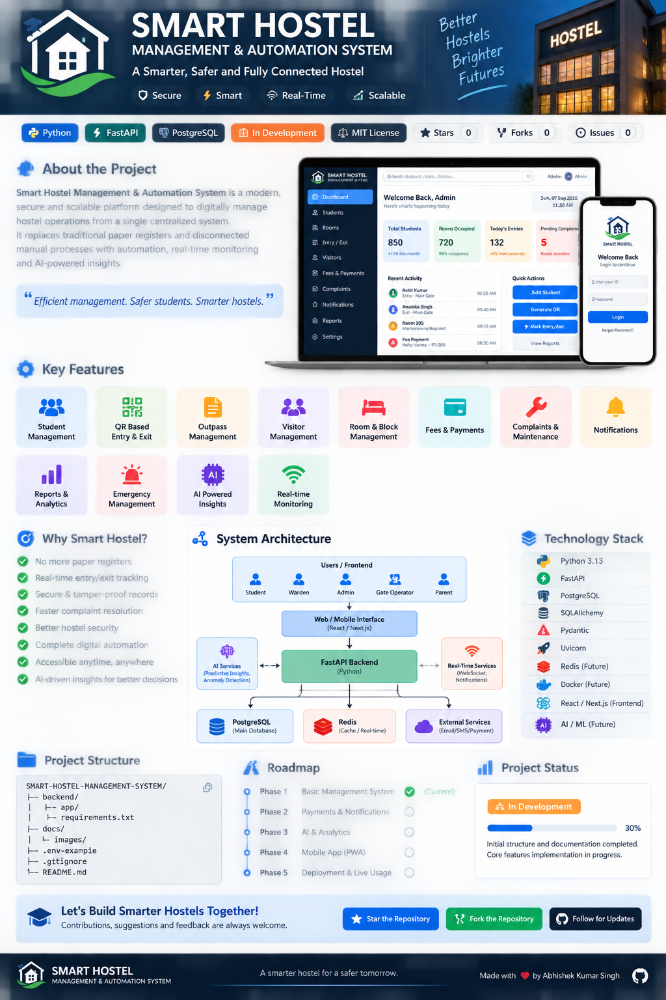
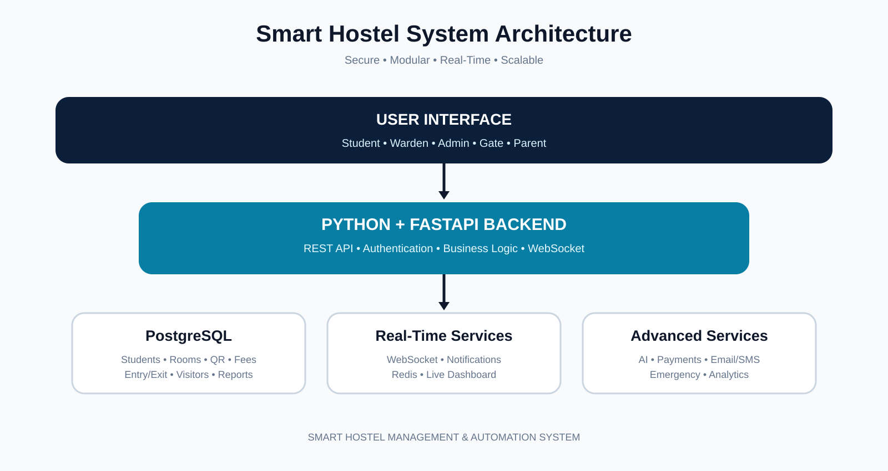

# 🏠 Smart Hostel Management & Automation System

<p align="center">
  
</p>

<p align="center"><strong>A Smarter, Safer and Fully Connected Hostel</strong></p>

<p align="center">
  
  
  
  
</p>

---

## 📌 Project Overview

**Smart Hostel Management & Automation System** is a modern, secure and scalable platform designed to digitally manage hostel operations from a single centralized system.

It aims to replace paper registers, manual entry/exit records and disconnected processes with a **smart, automated and real-time hostel management platform**.

### 🎯 Designed For

- 👨‍🎓 Students
- 👨‍💼 Wardens
- 🛡️ Administrators
- 🚪 Gate Operators
- 👨‍👩‍👧 Parents / Guardians

---

## 🖼️ Project Preview

<p align="center">
  
</p>

---

## 🚀 Why Smart Hostel?

Traditional hostel management can depend heavily on:

- ❌ Paper registers
- ❌ Manual entry/exit records
- ❌ Paper-based outpasses
- ❌ Difficult visitor tracking
- ❌ Separate fee records
- ❌ Delayed reporting
- ❌ Limited real-time visibility
- ❌ Difficult emergency management

### ✅ Expected Benefits

- Digital automation
- Real-time entry/exit tracking
- Secure QR-based verification
- Centralized student records
- Faster complaint resolution
- Better hostel security
- Integrated fee management
- Instant reports and analytics
- Live notifications
- AI-assisted insights

---

# ✨ Key Features

### 👨‍🎓 Student Management
- Student profile and status
- Hostel / block / room allocation
- Secure student identity and QR
- Entry / exit history
- Outpass & leave requests
- Fee information
- Complaints and notifications

### 📱 QR-Based Entry & Exit

```text
Student QR
    ↓
Gate Scanner
    ↓
Secure Verification
    ↓
Student Status Check
    ↓
Entry / Exit
    ↓
Database Update
    ↓
Live Dashboard
```

### 🚪 Outpass & Leave Management
- Online requests
- Warden approval/rejection
- Request history
- Validity tracking
- Return-time monitoring
- Late-return alerts

### 👥 Visitor Management
- Visitor registration
- Student association
- Visitor entry/exit
- Purpose of visit
- Visit history
- Security verification

### 🏢 Room & Block Management
- Blocks, floors and rooms
- Bed allocation
- Occupancy tracking
- Vacant/occupied status
- Student-room mapping

### 💳 Fees & Payments
- Fee records
- Pending fees
- Payment history
- Due-date tracking
- Receipts/reports
- Future payment gateway integration

### 🛠️ Complaints & Maintenance
- Complaint submission
- Categories and priorities
- Assignment and status tracking
- Resolution history
- Maintenance records

### 🔔 Notifications
- In-app notifications
- Email/SMS integration
- Outpass updates
- Fee reminders
- Complaint updates
- Emergency alerts

### 🚨 Emergency Management
- Emergency alerts
- Important announcements
- Gate monitoring
- Incident records
- Emergency reporting

### 📊 Reports & Analytics
- Student reports
- Entry/exit reports
- Outpass reports
- Visitor reports
- Room occupancy
- Fee reports
- Complaint reports
- Emergency reports

### 🤖 AI-Powered Insights
Planned capabilities include:
- Activity insights
- Anomaly detection
- Unusual entry/exit pattern detection
- Complaint trend analysis
- Predictive maintenance insights
- Administrative assistance

### ⚡ Real-Time Monitoring
- Live gate activity
- Entry/exit updates
- Live notifications
- Emergency events
- Dashboard activity
- WebSocket-based updates

---

# 🏗️ System Architecture

<p align="center">
  
</p>

```text
Users
  │
  ▼
Web / Mobile Interface
  │
  ▼
Python + FastAPI Backend
  │
  ├── Authentication
  ├── Business Logic
  ├── REST APIs
  ├── Real-Time Services
  └── Background Tasks
  │
  ▼
PostgreSQL Database
  │
  ├── Students
  ├── Rooms
  ├── Entries / Exits
  ├── Fees
  ├── Visitors
  ├── Complaints
  └── Reports
```

---

# 🧩 Technology Stack

| Layer | Technology |
|---|---|
| Backend | Python |
| API Framework | FastAPI |
| Database | PostgreSQL |
| ORM | SQLAlchemy |
| Validation | Pydantic |
| Server | Uvicorn |
| Authentication | JWT |
| Real-Time | WebSocket |
| Frontend | Planned Web UI |
| Mobile | PWA / future mobile app |
| AI | Planned AI service |
| Cache | Redis — future |
| Version Control | Git + GitHub |

---

# 📁 Project Structure

```text
SMART-HOSTEL-MANAGEMENT-SYSTEM/
│
├── backend/
│   ├── app/
│   │   ├── api/
│   │   ├── core/
│   │   ├── models/
│   │   ├── schemas/
│   │   ├── services/
│   │   ├── repositories/
│   │   ├── db/
│   │   ├── __init__.py
│   │   └── main.py
│   ├── tests/
│   └── requirements.txt
│
├── frontend/
├── ai-service/
├── database/
├── docs/
│   └── images/
│       ├── architecture.svg
│       ├── smart-hostel-banner.svg
│       └── readme-overview.png
├── tests/
├── .env.example
├── .gitignore
└── README.md
```

---

# 🔐 Security

Security is a core part of the planned system.

- 🔑 Authentication
- 🛡️ Role-based access control
- 🔐 Password hashing
- 🎫 JWT authentication
- 🔒 Environment-based secrets
- 📝 Audit logging
- 🚫 Protected APIs
- 🧹 Input validation
- 📊 Controlled data access

**Never commit real passwords, API keys or production secrets to GitHub.**

---

# 👥 User Roles

| Role | Main Responsibilities |
|---|---|
| 👨‍🎓 Student | Profile, QR, outpass, fees, complaints |
| 👨‍💼 Warden | Approvals, students, rooms, complaints |
| 🛡️ Admin | Complete system control and reports |
| 🚪 Gate Operator | QR verification and entry/exit |
| 👨‍👩‍👧 Parent | Student status and important updates |

---

# 🗺️ Development Roadmap

### Phase 1 — Foundation
- [x] GitHub repository setup
- [x] Professional project structure
- [x] README documentation
- [x] Architecture documentation
- [ ] Core database design

### Phase 2 — Core Management
- [ ] Authentication
- [ ] Student management
- [ ] Hostel/block/room management
- [ ] Outpass management
- [ ] Entry/exit management

### Phase 3 — Operations
- [ ] Visitor management
- [ ] Fees & payments
- [ ] Complaints & maintenance
- [ ] Notifications
- [ ] Reports & analytics

### Phase 4 — Smart Features
- [ ] Real-time dashboard
- [ ] Emergency management
- [ ] AI-powered insights
- [ ] Advanced analytics

### Phase 5 — Expansion
- [ ] PWA/mobile experience
- [ ] Payment gateway
- [ ] Advanced security integrations
- [ ] Multi-hostel support
- [ ] Production deployment

---

# 📊 Project Status

**🟠 In Development**

The repository foundation, project structure and documentation assets are prepared. Core implementation will be developed incrementally.

---

# 🤝 Contributing

Contributions, suggestions and feedback are welcome.

```text
Fork
  ↓
Create a feature branch
  ↓
Make your changes
  ↓
Test
  ↓
Commit
  ↓
Open a Pull Request
```

---

# ⭐ Support the Project

If you find this project useful:

- ⭐ Star the repository
- 🍴 Fork the repository
- 💡 Share suggestions
- 🐛 Report issues
- 🤝 Contribute improvements

---

## 📜 License

**To Be Added**

---

<p align="center">
  <strong>🏠 Smart Hostel Management & Automation System</strong><br>
  <em>A smarter hostel for a safer tomorrow.</em><br><br>
  Built with ❤️ by <strong>Abhishek Kumar Singh</strong>
</p>
